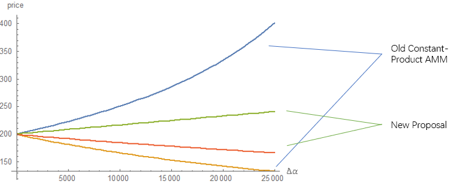

## Abstract
This proposal provides a new pricing formula of AMM that reduces the price slippage and increases efficiency by introducing the concept of risk exposure. This formula can be applied to both spot trades and perpetual contract trades.

The new price (`P`) formula in this proposal is based on the index price (`i`) and the risk exposure (`E`) in the pool. The price equals to the index price when there is no risk exposure. The greater the risk exposure, the farther the price is away from the index price.

```
P = i + β ∙ i ∙ E
```

## Motivation
AMM provides on-chain trading interfaces to the traders and funding rate to decentralized perpetual contracts. However, the current Uniswap-like formula is less capital efficient.

The Uniswap-like formula has a tricky feature to ensure that the funds in the pool will never be exhausted by infinitely increasing the price. But there are 2 disadvantages at the same time: 

1. Larger orders tend to suffer greater slippage. On average, only 1% of the pool's funds can maintain reasonable prices.
2. When the price leaves the liquidity provider's entry price, there will be impermanent losses, compared with holding the equivalent position + collateral.

From a macro perspective, the old price formula did not make use of the index price, and it only priced based on the inventory in the pool, which was a lack of efficiency. In fact, human market makers will consider the index price and place the orders near the middle price, while the liquidity far away from the middle price is limited.

## Rationale and features
The proposed price (`P`) formula introduces both index price (`i`) and risk exposure (`E`). The price equals to the index price when there is no risk exposure. The greater the risk exposure, the farther the price is away from the index price.

Most of the liquidity will be concentrated around the index price. Putting more capital near the central price, rather than providing unlimited market-making price range, can increase capital utilization.


 
When the risk exposure (`E`) is 0, the price is equal to the index price (i). When the net position held by the AMM increases, the risk exposure also increases. The formula `(P = i + β ∙ i ∙ E)` will provide a premium or discount. Just like the behavior of human market makers.

Note that Risk exposure may cause Liquidity Provider to gain or lose. Suppose a trader shorts 100ETH, AMM is always the counterparty of traders, so AMM has 100ETH long positions. If later the index price drops by half, even if the previous trade was executed at a discounted price, the discounted gain cannot guarantee the loss caused by the fall in the index price.

Therefore, AMM relies on arbitrageurs to arbitrage between AMM and other exchanges or assets. If traders buy a lot, the `E` increases and the price is higher than the index price, arbitrageurs would sell, thereby lowering `E`. So arbitrageurs are reducing the risk of Liquidity Provider.

The new proposed AMM has the following features. We assume `β` = 0.1.

**Better capital efficiency**: Under the same trading volume, if traders need to maintain the same trading slippage, the required liquidity will be reduced. ex: If the expected slippage = 0.5%, the liquidity required in the old formula increases rapidly with the demand for transactions.


**Lower slippage**: If the Liquidity Provider provides the same liquidity, the slippage of the new AMM is significantly reduced. ex: If `y` = 5,000 ETH (about $1M), Bob wants to buy 500 ETH(about $100k), the slippage will decrease from 11% to 0.25%.



**Zero impermanent loss**: Impermanent loss usually occurs when the index price changes. If the index price changes in old AMM, the total value of assets in the liquidity pool will always be lower than holding them in your wallet. On the other hand in the new AMM, the change in total asset value is only related to risk exposure.

If the risk exposure is 0 and the index price changes, the price in new AMM automatically follows the index price, and Liquidity Provider’s risk exposure will not change. The total asset value will not change.

If the risk exposure is not 0, arbitrageurs are helping Liquidity Providers reduce their risk exposure. Arbitrageurs tend to move prices toward index prices, which at the same time tends to zero the provider's risk exposure.


**Limited market making price range**: The only trade-off for the new AMM is that since all inventory capital needs to be concentrated near the index price, the new AMM can only provide a limited market-making scope. For example, when the long position in AMM is exhausted, the trader cannot continue to long with AMM. The price range of services provided by new AMM mainly depends on the liquidity provided.

## Application in spot trading
Define:
* `x`: The reserve of quote tokens in AMM (ex: USD).
* `x0`: The number of quote tokens deposited by liquidity providers.
* `y`: The reserve of base tokens in AMM (ex: ETH).
* `y0`: The number of base tokens deposited by liquidity providers.
* `i`: Index price.
* `β`: Liquidity parameter.
* `Side = BUY or SELL`: The side of the risk exposure. The initial risk exposure is 0, If the  Traders’ buying volume is larger than selling volume, the AMM’s `Side = SELL`, Otherwise `Side = BUY`.
* `E(Δα)`: Risk exposure after a Trader trades `Δα` from AMM. The definition of `E(Δα)` depends on the `Side`.

When the AMM is in the `SELL` state, which means `y < y0`. The unit of `Δα` is base token. A positive `Δα` means the trader buys from AMM. So AMM’s reserve of base tokens will decrease after trade. A negative `Δα` means the Trader sells to AMM. So AMM’s reserve of base tokens will increase after trade.


When the AMM is in the `BUY` state, which means `x < x0`. The unit of `Δα` is quote token. A positive `Δα` means the trader buys from AMM. So AMM’s reserve of quote tokens will increase after trade. A negative `Δy` means the Trader sells to AMM. So AMM’s reserve of quote tokens will decrease after trade.


* `P(Δα)`: Average transaction price if a Trader trades `Δα` with AMM.

```
P(Δα) = i + β ⋅ i ⋅ E(Δα)
```

* Property 1: If a Trader buys from AMM, the Price will linearly increase. If a Trader sells to AMM, the Price will linearly decrease.
* Property 2: If a Trader buys `Δα` from AMM and then sells `Δα` to AMM, the 2 average transaction prices are the same, and the final AMM status recovers to the initial status.
* Property 3: If a trader either `buy(Δα1), buy(Δα2)` or `buy(Δα1 + Δα2)`, the 2 average transaction prices are the same, and the final AMM status are the same.
* Property 4: Market making depth is limited. When risk exposure is zero, `max{buy} = y`, `max{sell} = x`.

**Example**: Bob buys `Δα = 20`, when

```
x0 = x = 10000, y0 = y = 100, β = 0.1, i = 100
```


```
y' = y - Δα = 80
x' = x + price(20) · Δα = 10000 + 101 ∙ 20 = 12020
```

The price after Bob’s operation is


## Application in perpetual trading
In a perpetual AMM contract, long positions are fully collateralized, so the long position is equivalent to the base token in the spot trading.

Define:
* `CashBalance`: The collateral that Liquidity Provider deposited. If the Liquidity Provider wants to provide positions, the `CashBalance` and `y` are both increasing.
* `x`: Available balance. The unit is the collateral (ex: USD). `x = CashBalance - EntryPrice ∙ y`
* `y`: Long position in AMM. The unit is contract (ex: ETH).
* `EntryPrice`: Entry price of the long position in AMM.
* `γ`: Funding Rate parameter.
* `E(Δα)` and `P(Δα)` are the same as spot trading.
* `FundingRate`: Positive value means all long positions pay to short positions. Negative value means all short positions pay to long positions.

```
FundingRate = γ ∙ E(0)
```

Note that if a Trader buys/longs `dy` contracts, AMM’s `y` is decreased by `dy`. Since the AMM is closing long position, add `PNL = (P - EntryPrice) · y` to the CashBalance. So that `x` is increased by `(P - EntryPrice) · y + EntryPrice · y = P · y` which is equivalent to spot trading.

**Example**: Bob buys `Δα = 20`, when
```
x = 10000, y0 = y = 100, β = 0.1, i = 100, EntryPrice = 100, CashBalance = 20000
```


```
y' = y - Δα = 80
AMM's PNL = (price(20) - EntryPrice) Δα = 20
x' = CashBalance - EntryPrice ∙ y' + PNL = 20000 - 100 ∙ 80 + 20 = 12020
```

The price after Bob’s operation is


